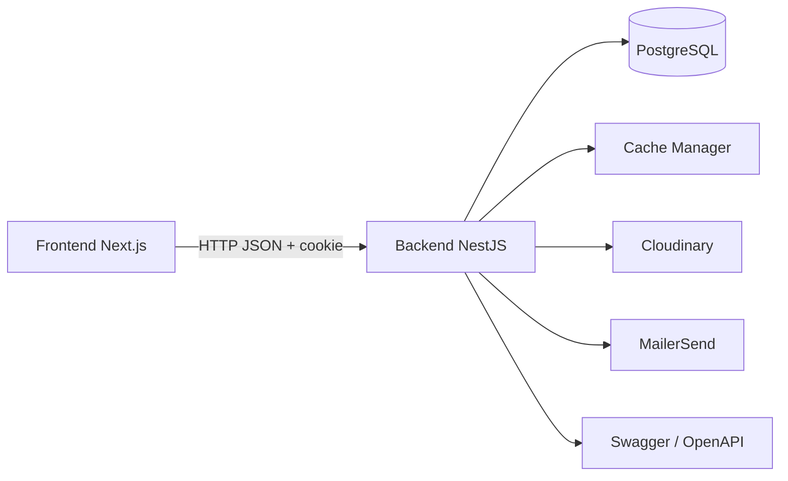

# Arquitetura

## Visao geral

O Luxis e um monorepo npm com dois workspaces:

- `backend`: API NestJS, dominio, persistencia, autenticacao e jobs de suporte.
- `frontend`: aplicacao Next.js com App Router, internacionalizacao e cliente React Query.

A comunicacao principal e HTTP/JSON. A sessao do navegador usa cookie JWT httpOnly; clientes nao-browser podem usar Bearer token conforme o contrato de autenticacao.



## Backend

O backend segue Clean Architecture e DDD por modulo:

```text
backend/src/modules/<context>/
  application/   DTOs, servicos, casos de uso e estrategias
  domain/        entidades, value objects, enums e contratos
  presentation/  controllers e adaptadores HTTP
  <context>.module.ts
```

Contextos atuais:

- `auth`: login, sessao, senha e recuperacao de acesso.
- `user`: usuarios, perfis, status e administracao.
- `category`: categorias de produto.
- `product-model`: modelos e catalogo base.
- `product`: unidades e numeros de serie.
- `batch`: lotes, entradas e custos.
- `inventory`: disponibilidade e consultas de estoque.
- `sale`: vendas, pagamentos, parcelas e devolucoes relacionadas.
- `return`: devolucoes e reintegracao.
- `shipment`: remessas e estados de entrega.
- `ownership-transfer`: transferencia entre revendedores.
- `customer`: clientes.
- `customer-portfolio`: relacao de clientes e revendedores.
- `supplier`: fornecedores.
- `kpi`: indicadores administrativos e de revendedor.

### Camada compartilhada

`backend/src/shared` concentra:

- configuracao e validacao de ambiente;
- TypeORM, entidades de persistencia e migracoes;
- JWT, Passport, guards e regras CASL;
- logging estruturado com Pino;
- filtros de excecao, eventos e utilitarios.

`AppModule` registra os contextos, o banco, cache, logger, throttling e regras CASL. `main.ts` configura CORS, `ValidationPipe`, Swagger e o healthcheck.

### Regras de entrada

A API usa `ValidationPipe` global com:

- `transform: true`;
- `whitelist: true`;
- `forbidNonWhitelisted: true`.

DTOs sao o limite entre HTTP e aplicacao. Entidades e value objects concentram invariantes de dominio; repositorios abstraem persistencia.

## Frontend

O frontend usa Next.js 16, React 19 e App Router:

```text
frontend/src/
  app/          rotas, layouts, handlers e paginas
  components/   componentes de dominio e componentes UI
  hooks/        acesso a dados e comportamento reutilizavel
  lib/          cliente HTTP, i18n, auth e utilitarios
  stores/       estado global Zustand
  messages/     traducoes pt/en
  api/          codigo gerado pelo Orval
```

### Rotas de negocio

- `/[locale]/home`: area administrativa.
- `/[locale]/my-space`: area do revendedor.
- `/[locale]/login`: login do revendedor.
- `/[locale]/admin-login`: login administrativo.
- `/[locale]/sign-up`: cadastro.
- `/[locale]/reset-password/[token]`: redefinicao de senha.

As rotas sem locale continuam disponiveis como aliases/redirects de compatibilidade.

### Middleware e sessao

`frontend/middleware.ts`:

1. aplica locale com `next-intl`;
2. le o cookie de autenticacao;
3. valida expiracao basica do JWT;
4. impede acesso de usuario inativo ou com papel incorreto;
5. redireciona admin e revendedor para suas areas.

A validacao definitiva da sessao permanece no backend. O middleware nao substitui assinatura/verificacao criptografica do servidor.

## Fluxo de uma funcionalidade

1. Controller recebe e valida o DTO.
2. Caso de uso coordena a regra de aplicacao.
3. Entidades/value objects validam invariantes de dominio.
4. Repositorio persiste ou consulta dados.
5. Eventos e servicos compartilhados tratam efeitos secundarios.
6. Controller retorna DTO/resposta HTTP documentada no Swagger.
7. O frontend consome o contrato gerado via React Query.

## Decisoes de infraestrutura

- PostgreSQL e o banco de producao.
- SQLite e usado em cenarios de teste locais.
- TypeORM permanece na linha `0.3.x`, pois a linha `1.x` altera APIs de driver, relacoes e selecoes usadas pelo projeto.
- Biome e a ferramenta unica de formatacao/lint.
- SWC transforma TypeScript e decorators nos testes Jest do backend.
